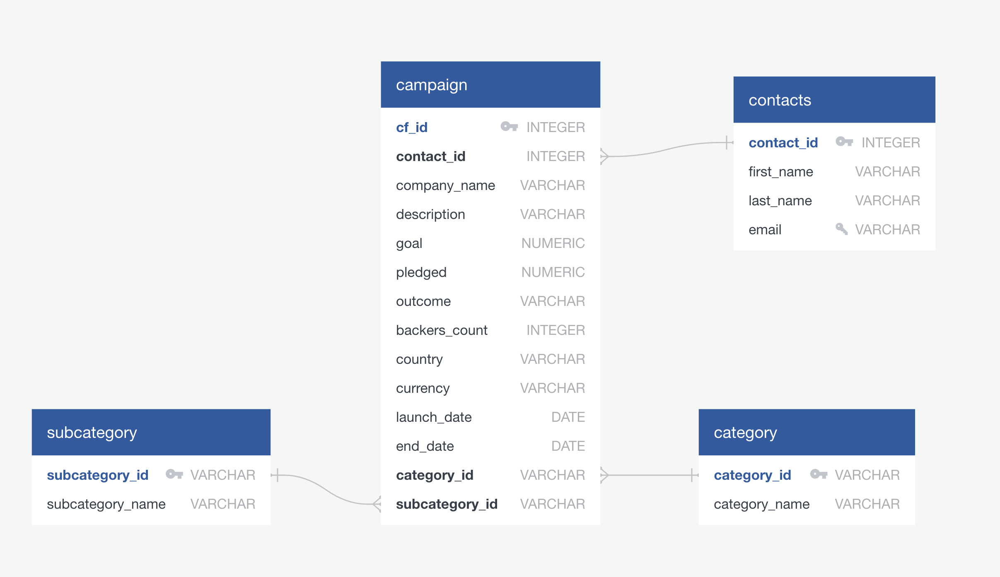

# Crowdfunding_ETL

## Data Analytics Bootcamp - Project 2

### **Team Members:**
- **Sean Schallberger**
- **Bryan Carney**
- **Yadav Dhruvi**

### **Project Timeline:**
- **Start Date:** January 23, 2025
- **Due Date:** January 30, 2025 (11:59 PM)

---

## **Overview**
This project focuses on building an **ETL (Extract, Transform, Load)** pipeline using Python, Pandas, and PostgreSQL. By extracting and transforming data, we generated **CSV files**, created an **Entity-Relationship Diagram (ERD)**, defined a **table schema**, and uploaded data to a PostgreSQL database. This project demonstrates end-to-end ETL pipeline development and database integration.

---

## **Project Objectives**
1. Extract data from Excel files.
2. Transform the data into a format suitable for database insertion.
3. Generate CSV files for different data entities.
4. Create a PostgreSQL database and corresponding tables.
5. Load data into the PostgreSQL database.
6. Verify the database contents.

---

## **Highlights of Skills and Tools**

### **Programming Languages:**
- Python
- SQL

### **Libraries:**
- Pandas
- NumPy
- Regular Expressions

### **Tools:**
- PostgreSQL
- pgAdmin
- Jupyter Notebook

### **ETL Processes:**
- Data extraction, transformation, and loading

### **Visualization:**
- Entity-Relationship Diagram (ERD)

---

## **Key Learning Outcomes**
- Hands-on experience in designing and implementing an ETL pipeline.
- Proficiency in cleaning, transforming, and structuring raw data for database integration.
- Practical application of PostgreSQL for relational database design and querying.

---

## **Deliverables**

### **1. Extract and Transform Data**

#### **Category DataFrame**
- Columns:
  - `category_id`: Sequential entries (e.g., `cat1`, `cat2`, ...).
  - `category`: Unique category titles.
- Exported as **`category.csv`**.

#### **Subcategory DataFrame**
- Columns:
  - `subcategory_id`: Sequential entries (e.g., `subcat1`, `subcat2`, ...).
  - `subcategory`: Unique subcategory titles.
- Exported as **`subcategory.csv`**.

#### **Campaign DataFrame**
- Columns:
  - `cf_id`
  - `contact_id`
  - `company_name`
  - `description` (formerly `blurb`)
  - `goal` (float)
  - `pledged` (float)
  - `outcome`
  - `backers_count`
  - `country`
  - `currency`
  - `launch_date` (datetime)
  - `end_date` (datetime)
  - `category_id` (matches `category.csv`)
  - `subcategory_id` (matches `subcategory.csv`)
- Exported as **`campaign.csv`**

#### **Contacts DataFrame**
- Columns:
  - `contact_id` (integer)
  - `first_name`
  - `last_name`
  - `email`
- Exported as **`contacts.csv`**.

---

### **2. Database Schema and Integration**
- **Database Name:** `crowdfunding_db`
- **Database Creation Script:** `crowdfunding_db_schema.sql`
  - This file includes the schema and table definitions for the following tables:
    - `category`
    - `subcategory`
    - `campaign`
    - `contacts`
  - Relationships and constraints are defined with **primary keys** and **foreign keys**.
- Steps:
  - Imported CSV data into corresponding tables.
  - Verified data insertion with `SELECT *` statements.

---

### **Entity-Relationship Diagram (ERD)**

The following diagram illustrates the relationships between the tables in the database:



---

## **Repository Folder Structure**
```
Crowdfunding_ETL/
│
├── ETL_Mini_Project_SSchallberger_BCarney_YDhruvi.ipynb   # Main project notebook
├── crowdfunding_ERD.png                                   # Database ERD diagram
├── crowdfunding_db_schema.sql                             # SQL schema file
├── Resources/                                             # Input files and raw data
│   ├── crowdfunding.xlsx                                  # Crowdfunding data source
│   ├── contacts.xlsx                                      # Contacts data source
│   ├── category.csv                                       # Transformed category data
│   ├── subcategory.csv                                    # Transformed subcategory data
│   ├── campaign.csv                                       # Transformed campaign data
│   ├── contacts.csv                                       # Transformed contacts data
├── Individual_Work/                                       # Individual contributions
│   ├── Sean Schallberger/                                 # Contains Sean's individual work files
│   ├── Bryan Carney/                                      # Contains Bryan's individual work files
│   ├── Dhruvi Yadav/                                      # Contains Dhruvi's individual work files
```

---

## **Instructions**

### **Setup**
1. Clone the repository:
   ```bash
   git clone https://github.com/yourusername/Crowdfunding_ETL.git
   ```
2. Navigate to the project directory:
   ```bash
   cd Crowdfunding_ETL
   ```

### **Run the Project**

#### **ETL Pipeline**
- Open and run `ETL_Mini_Project_SSchallberger_BCarney_YDhruvi.ipynb` in Jupyter Notebook.

#### **Database Setup**
1. The provided `crowdfunding_db_schema.sql` file has the database creation commands commented out at the top:
   ```sql
   -- DROP DATABASE IF EXISTS crowdfunding_db;
   -- CREATE DATABASE crowdfunding_db;
   -- \c crowdfunding_db;
   ```
   This means the database must either be created manually through **pgAdmin** or via the terminal before running the script. Follow these steps:
   
   **Option A: Create Database Manually in pgAdmin**
   - Open pgAdmin and create a new database named `crowdfunding_db`.
   - Right-click on the database and open the Query Tool.
   - Run the schema file (`crowdfunding_db_schema.sql`) to create the necessary tables.

   **Option B: Use Terminal Commands**
   - Open your terminal and log into PostgreSQL:
     ```bash
     psql -U username
     ```
   - Create and connect to the database by running:
     ```sql
     CREATE DATABASE crowdfunding_db;
     \c crowdfunding_db;
     ```

2. Once the database is created, execute the schema script:
   ```bash
   psql -U username -d crowdfunding_db -f crowdfunding_db_schema.sql
   ```
3. Import CSV data into the database in the following order with the specified settings:
   - **Order**: `category.csv`, `subcategory.csv`, `contacts.csv`, `campaign.csv`
   - **Settings**: Delimiter = `,`, Header = `True`
4. Verify table contents with SQL queries. You can use one or more of the following approaches:
   - **Option 1**: Run `SELECT * FROM table_name;` for each table to view all records.
   - **Option 2**: Use `SELECT COUNT(*) FROM table_name;` to confirm the number of rows imported matches expectations.
   - **Option 3**: Execute specific queries to validate data integrity, such as checking relationships between tables:
     ```sql
     SELECT c.category, s.subcategory
     FROM category c
     JOIN subcategory s ON c.category_id = s.category_id;
     ```

---

## **Project Timeline**
| Date       | Milestone                                   |
|------------|--------------------------------------------|
| Jan 23     | Project Kickoff                            |
| Jan 24     | Category and Subcategory DataFrames        |
| Jan 25     | Campaign DataFrame                         |
| Jan 26     | Contacts DataFrame                         |
| Jan 27     | Database Schema and Integration            |
| Jan 28     | Testing and Debugging                      |
| Jan 29     | Final Documentation and Submission         |